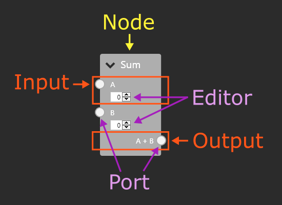
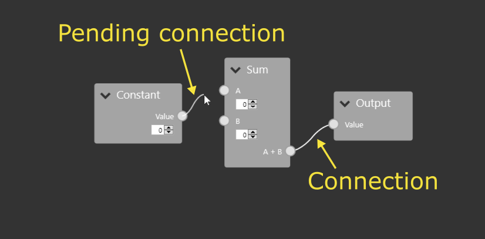
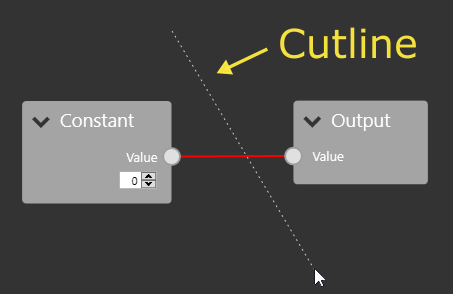
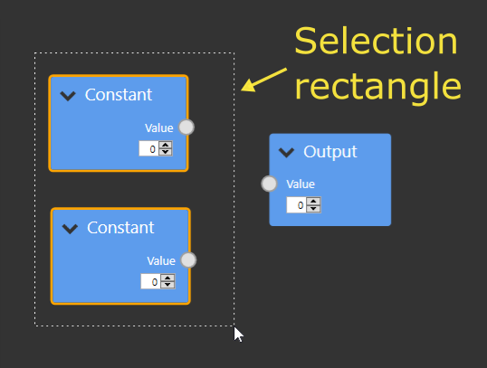

# Overview of visual components/terminology

In order to understand the code and documentation, it is important to understand the naming scheme for the GUI controls. The general hierarchy is as follows:

- Network
	- Node(s)
		- Input(s)
			- Editor
			- Port
		- Output(s)
			- Editor
			- Port
	- Connection(s)
	- Pending connection
	- Cutline
	- Selection rectangle

The next few sections go into more detail about what these controls are and what they do.

## Node components
A node is a draggable container for endpoints (= inputs and outputs) that represents a function.
Both inputs and outputs have a 'port' that is used to create or remove connections.
Inputs often have an 'editor', which can be used to control the behaviour of the node when the input has no connection. Outputs can also have an editor to configure the output, but keep in mind that it might be better to configure the output using inputs.  
A picture is worth a thousand words, so here is a more visual diagram of a node and its contents:

## Connections
A 'Connection' is a tuple consisting of an input and an output. Connections can only be formed between different nodes. Each input can only have 1 associated connection, while outputs can have unlimited.

When the user click and drags from a port, a 'pending connection' is created. This is a connection that is kept seperate from the 'real' connections until the user confirms its creation. While it has an input and an output property, either can be null depending on where the user clicked down and what the cursor is currently over. 

## Cutline
The 'cutline' is a line that is shown when the user clicks and drags the right mouse button. All connections that intersect with the line are highlighted and are removed on mouseup.

## Selection rectangle
The selection rectangle is shown when the user holds shift and left clicks and drags. Any node that intersects or is contained in the rectangle is selected, while all others are unselected.

