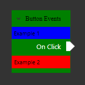

# Cookbook: Customizing node visuals

The visual appearance of nodes can be modified to better fit specific usecases.
This chapter assumes you have creates custom node viewmodels as is explained in ["Creating custom node types"](custom_nodes).

## Replacing the view

In your node viewmodel class, you should have added a line that specifies its matching view class.

```
static HelloWorldNode()
{
    Splat.Locator.CurrentMutable.Register(() => new NodeView(), typeof(IViewFor<HelloWorldNode>));
}
```

Here `new NodeView()` specifies that the default NodeView is to be used.
To modify the appearance of the node, create a new UserControl to be used as the replacement node view.
Then, replace `new NodeView()` with your own new view class.

```
<UserControl x:Class="Example.CustomNodeView"
             ...
             >
    <views:NodeView x:Name="NodeView"/>
</UserControl>
```

```
public partial class CustomNodeView : IViewFor<CustomNodeViewModel>
{
    #region ViewModel
    ...
    #endregion

    public CustomNodeView()
    {
        InitializeComponent();

        this.WhenActivated(d =>
        {
            this.WhenAnyValue(v => v.ViewModel).BindTo(this, v => v.NodeView.ViewModel).DisposeWith(d);
        });
    }
}
```

In the previous snippet, I left out the `ViewModel` property for clarity and brevity of the example. Its declaration is a piece of boilerplate ReactiveUI code to create a WPF property that holds the ViewModel. It looks like this:
    public static readonly DependencyProperty ViewModelProperty = 
        DependencyProperty.Register(nameof(ViewModel), typeof(CustomViewModel), typeof(CustomView), new PropertyMetadata(null));

```
public CustomViewModel ViewModel
{
    get => (CustomViewModel)GetValue(ViewModelProperty);
    set => SetValue(ViewModelProperty, value);
}

object IViewFor.ViewModel
{
    get => ViewModel;
    set => ViewModel = (CustomViewModel)value;
}
```

## NodeView properties

In your new node view class, you can now set several properties on the NodeView object.

```
<views:NodeView x:Name="NodeView"
                TitleFontFamily="Times New Roman" TitleFontSize="13" Background="Green" Foreground="Black"
                ArrowSize="9" CornerRadius="0">
    <views:NodeView.LeadingControlPresenterStyle>
        <Style TargetType="ContentPresenter">
            <Setter Property="ContentTemplate">
                <Setter.Value>
                    <DataTemplate>
                        <Label Background="Blue">Example 1</Label>
                    </DataTemplate>
                </Setter.Value>
            </Setter>
        </Style>
    </views:NodeView.LeadingControlPresenterStyle>
    <views:NodeView.TrailingControlPresenterStyle>
        <Style TargetType="ContentPresenter">
            <Setter Property="ContentTemplate">
                <Setter.Value>
                    <DataTemplate>
                        <Label Background="Red">Example 2</Label>
                    </DataTemplate>
                </Setter.Value>
            </Setter>
        </Style>
    </views:NodeView.TrailingControlPresenterStyle>
</views:NodeView>
```


