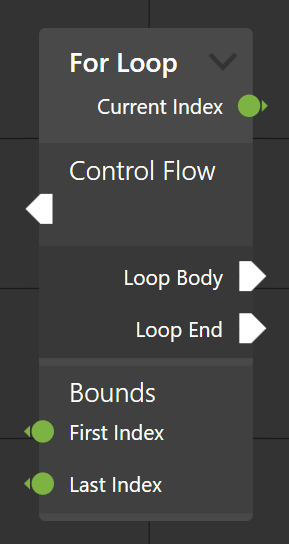

# Group endpoints

To make the list of endpoints more readable, it can be desirable to group endpoints. This allows you to place a set of semantically similar inputs and outputs together under a common header, seperated from the other endpoints.



Creating and assigning a group to endpoints works as follows.
First, create a new `EndpointGroup`. The constructor takes an optional name and parent group. The name, if set, will be displayed above the endpoint group in the node. If the parent group is set, the group will be nested under its parent in the nodeview.
After creating the group, simply assign it to endpoints using their `Group` parameter. 

```csharp
var exampleGroup = new EndpointGroup("Example group");
var exampleInput = new InputViewModel
{
    Name = "Example input",
    Group = exampleGroup
};
this.Inputs.Add(exampleInput);
```

Upon assignment, the groups are converted into `EndpointGroupViewModel`s, which are then displayed in the node as a `EndpointGroupView`. If you prefer to use your own endpoint group viewmodel type, set the `EndpointGroupViewModelFactory` property on the `NodeViewModel` to use your type.