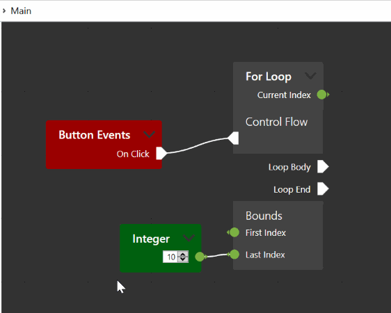

# Group nodes

There are several reasons to group nodes. As network become larger, they get harder to read. Implementation details can clutter the view where an abstract representation would suffice. Providing a grouping operation to the user allows them to create abstractions. This has the additional benefit that the abstraction can potentially be reused by copying the group. Lastly, performance is improved when there are less nodes on the screen.

NodeNetwork has some built-in systems to facilitate node grouping. This article explains how to add basic support for grouping. The [CodeGenApp example](https://github.com/Wouterdek/NodeNetwork/tree/master/ExampleCodeGenApp) contains a full implementation of grouping support.



## Components

The library uses the following terminology:
 - Supernetwork: the parent network in which a set of nodes is replaced with a single group node.
 - Subnetwork: the child network to which the set of group member nodes is moved.
 - Group node: the node in the parent network that replaces the the group member nodes.
 - Inlet/outlet: just like a node has input and outputs, a group has inlets and outlets. An inlet is represented in the supernetwork on the group node with an input, and in the subnetwork with an output. An outlet is represented in the supernetwork on the group node with an output, and in the subnetwork with an input.
 - Entrance/exit node: the subnetwork needs nodes on which to place the inlet/outlet endpoints. The entrance node, placed on the left, generally contains inlets. The exit node, placed on the right, generally contains outlets.

## Getting started with grouping 

To group a set of nodes, create a new `NodeGrouper` from the `NodeNetworkToolkit` library. This class has several properties that need to be set before usage. 

 - GroupNodeFactory: A delegate that constructs a new node that represents a group of nodes. The parameter is the subnetwork (constructed with SubNetworkFactory) that contains the group member nodes.
 - EntranceNodeFactory/ExitNodeFactory: Delegates that construct entrance/exit nodes.
 - SubNetworkFactory: A delegate that construct a `NetworkViewModel` for the subnetwork.
 - IOBindingFactory: A delegate that constructs a `NodeGroupIOBinding` from a group, entrance and exit node. The `NodeGroupIOBinding` class is explained below.

A simple setup might look like this:

```csharp
var grouper = new NodeGrouper
{
    GroupNodeFactory = subnet => new NodeViewModel { Name = "Group" },
    EntranceNodeFactory = () => new NodeViewModel { Name = "Entrance" },
    ExitNodeFactory = () => new NodeViewModel { Name = "Exit" },
    SubNetworkFactory = () => new NetworkViewModel(),
    IOBindingFactory = (groupNode, entranceNode, exitNode) =>
        new ValueNodeGroupIOBinding(groupNode, entranceNode, exitNode)
};
```

The `NodeGrouper` class provides two methods, `MergeIntoGroup(NetworkViewModel network, IEnumerable<NodeViewModel> nodesToGroup)` and `Ungroup(NodeGroupIOBinding groupInfo)`, for creating and dissolving groups.

## IO Binding

While the `NodeGrouper` is responsible for moving nodes and connections around to create groups, a `NodeGroupIOBinding` handles the logic behind the inlets and outlets of the group. A default implementation called `ValueNodeGroupIOBinding` is available for applications that use the value nodes explained in [this chapter](value_nodes). It is likely you will want to subclass this type and override some of its methods.

The IOBinding is responsible for several operations:

 - Creating and placement of endpoints, both in sub- or supernetwork.
 - Retrieval of endpoints, given a counterpart in the other network.
 - Removal of endpoints, along with the counterpart in the other network.
 - Binding of endpoint properties between sub- and supernetwork, for a consistent UI.
 - Binding of endpoint value streams between sub- and supernetwork.

More details can be found in the implementation mentioned above.

## Extras

The library provides two optional components to navigate and edit groups.

 - The `AddEndpointDropPanel` can be placed on the group/entrance/exit nodes using the `TrailingControlPresenterStyle`. This component allows users to add inlets/outlets simply by dragging a connection to the node.
 - The `BreadcrumbBar` shows a series of buttons indicating the current network and all networks above it. Users can press these buttons to exit groups and return to supernetworks.

More information on these components can be found in the [CodeGenApp example](https://github.com/Wouterdek/NodeNetwork/tree/master/ExampleCodeGenApp).
