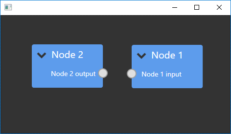

# Cookbook: Hello world in under 30 lines.

This section will show how to setup a simple Hello world example in under 30 lines of code.
It assumes you know how to create a new project and install the NodeNetwork library. Read [this](./new_project) if you need more information.

At the end of this section you will have created something like this:



## Step 1: Creating the view

The Model-View-ViewModel pattern is used throughout the NodeNetwork library. For an introduction to MVVM, look [here](https://www.codeproject.com/Articles/100175/Model-View-ViewModel-MVVM-Explained). To use elements from the library, you need to create the appropriate view and provide it with an instance of the corresponding viewmodel class.

Open your newly created project and open MainWindow.xaml. It should look something like this:

```XAML
<Window x:Class="NodeNetworkExample.Window1"
        xmlns="http://schemas.microsoft.com/winfx/2006/xaml/presentation"
        xmlns:x="http://schemas.microsoft.com/winfx/2006/xaml"
        xmlns:d="http://schemas.microsoft.com/expression/blend/2008"
        xmlns:mc="http://schemas.openxmlformats.org/markup-compatibility/2006"
        xmlns:local="clr-namespace:NodeNetworkExample"
        mc:Ignorable="d">
        <Grid>
        </Grid>
</Window>
```

Add the NodeNetwork namespace to the Window, and then a NetworkView to the Grid so it looks like this:

```XAML
<Window x:Class="NodeNetworkExample.Window1"
        xmlns="http://schemas.microsoft.com/winfx/2006/xaml/presentation"
        xmlns:x="http://schemas.microsoft.com/winfx/2006/xaml"
        xmlns:d="http://schemas.microsoft.com/expression/blend/2008"
        xmlns:mc="http://schemas.openxmlformats.org/markup-compatibility/2006"
        xmlns:local="clr-namespace:NodeNetworkExample"
        xmlns:nodenetwork="clr-namespace:NodeNetwork.Views;assembly=NodeNetwork"
        mc:Ignorable="d">
        <Grid>
              <nodenetwork:NetworkView x:Name="networkView" />
        </Grid>
</Window>
```

## Step 2: Setting up the viewmodel

Open the code-behind of MainWindow.xaml. It should look something like this:

```Csharp
using System.Windows;

namespace NodeNetworkExample
{
    public partial class MainWindow : Window
    {
        public MainWindow()
        {
            InitializeComponent();
        }
    }
}
```

Add the `NodeNetwork.ViewModels` namespace and change the function body to this:


```Csharp
InitializeComponent();

//Create a new viewmodel for the NetworkView
var network = new NetworkViewModel();

//Create the node for the first node, set its name and add it to the network.
var node1 = new NodeViewModel();
node1.Name = "Node 1";
network.Nodes.Add(node1);

//Create the viewmodel for the input on the first node, set its name and add it to the node.
var node1Input = new NodeInputViewModel();
node1Input.Name = "Node 1 input";
node1.Inputs.Add(node1Input);

//Create the second node viewmodel, set its name, add it to the network and add an output in a similar fashion.
var node2 = new NodeViewModel();
node2.Name = "Node 2";
network.Nodes.Add(node2);

var node2Output = new NodeOutputViewModel();
node2Output.Name = "Node 2 output";
node2.Outputs.Add(node2Output);

//Assign the viewmodel to the view.
networkView.ViewModel = network;
```

You should now be able to run the Hello world example.