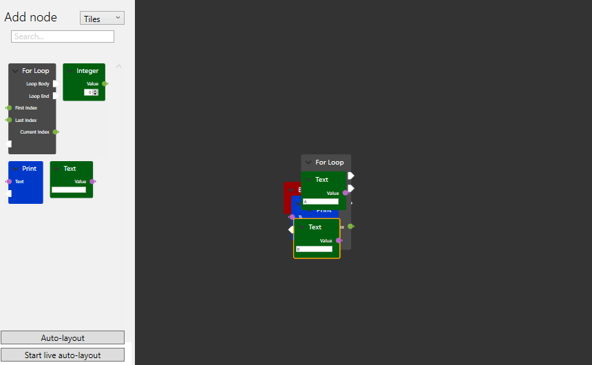
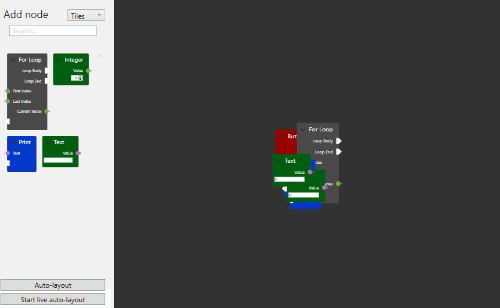

# Cookbook: Automatic layout of nodes

Sometimes you want to programmatically create a network and display it to the user.
Creating the nodes and connections is one thing, but for the network to be appealing to the user it should be properly layed out. By default, all nodes will end up at the origin point which makes for a cluttered mess.
However, choosing where to position the nodes is not a trivial task.
NodeNetwork provides utilities for solving this problem under the `NodeNetwork.Toolkit.Layout` namespace.

## Force-directed layout system

The [`NodeNetwork.Toolkit.Layout.ForceDirected.ForceDirectedLayouter`](/NodeNetwork/api/api/NodeNetwork.Toolkit.Layout.ForceDirected.ForceDirectedLayouter.html) class allows you to organise networks using a physics-based approach. The nodes are interpreted as point masses, and the connections are represented by springs. This system, along with a few additional forces such as friction and a horizontal force, is then simulated to calculate the new position of the nodes.

The class provides two methods: `Layout()` and `LayoutAsync`. The first will perform the full simulation at once and set the nodes to their final position. The second will update the nodes after each iteration of the simulation.

Here is a demo of `Layout()`:



```
ForceDirectedLayouter layouter = new ForceDirectedLayouter();
var config = new Configuration
{
    Network = yourNetwork,
};
layouter.Layout(config, 10000);
```

And this is a demo of `LayoutAsync`:



```
ForceDirectedLayouter layouter = new ForceDirectedLayouter();
var config = new Configuration
{
    Network = yourNetwork,
};
layouter.LayoutAsync(config, cancellationToken);
```

It's important to set and use the cancellation token for the async version as the method might not end out of itself.

Several different parameters in Configuration can be set to tweak the behaviour of the physics simulation.
More information about this can be found in the API documentation [here](/NodeNetwork/api/api/NodeNetwork.Toolkit.Layout.ForceDirected.Configuration.html).