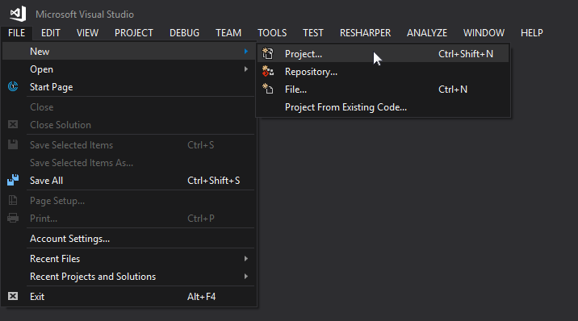
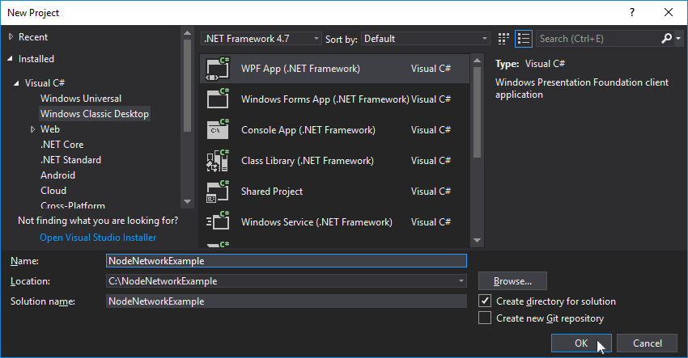
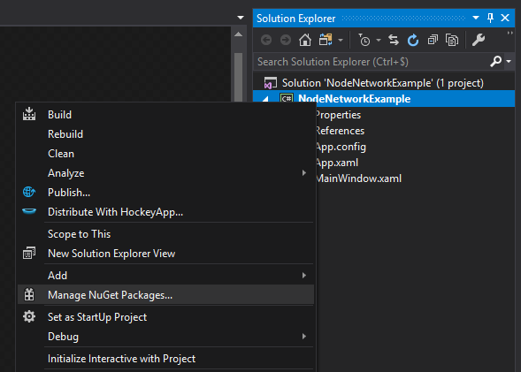
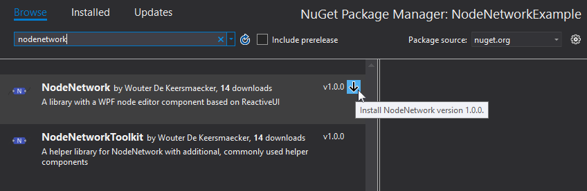

# Cookbook: Starting a new project with NodeNetwork

Starting a new project with NodeNetwork is as easy as creating a new VS project and adding the relevant packages from NuGet.  
If you know how to do that, you can skip this section.

## Step 1: Creating the project

Create a new Visual Studio project by choosing "Project..." under File -> New.

In the "New Project" dialog, choose **WPF App** and **set the .NET Framework version to 4.7 or higher.**  
Choose any name and location you like and press OK.

## Step 2: Installing the NodeNetwork packages
Right click your new project and choose "Manage NuGet Packages..."

Under "Browse", search for "NodeNetwork" and install the correct package. The webpage for the correct package can be found [here](https://www.nuget.org/packages/NodeNetwork/). A second package "NodeNetworkToolbox" is also available and provides components for common use-cases.

You are now ready to use NodeNetwork in your new application.