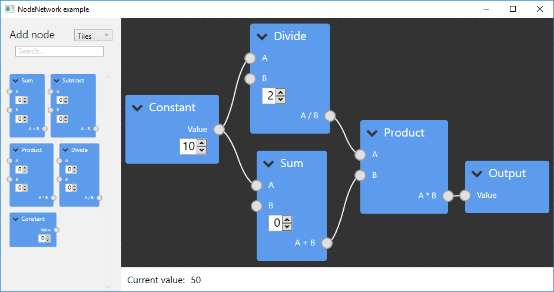
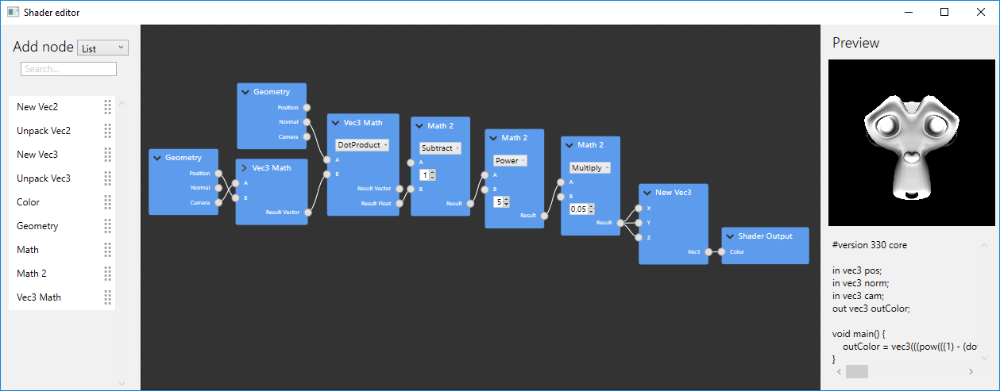
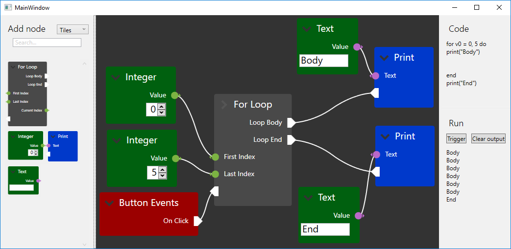

# Example projects

NodeNetwork has several example projects that demonstrate its features.
The projects range from simple introductionary projects to more complete, custom solutions.
Source code for these can be found in the GitHub repository, compiled versions can be found [here](https://github.com/Wouterdek/NodeNetwork/releases).

## Calculator

This example allows users to create mathematical expressions using a node editor. 
The resulting value is automatically calculated and updated when the network is modified.
This application contains examples of network validation, custom node subclasses, value inputs/outputs, custom input editors, node list, ...

## Shader Editor

The shader editor example allows users to create a simple GLSL shader. 
The shader is dynamically regenerated, recompiled and applied to a model for live inspection of the result.

## Code Generator

In this example, users can create LUA code. Similar to Blueprint in the Unreal Engine, the editor has execution flows and data flows.
Custom inputs/outputs, ports, nodes and editors give the editor a more intuitive experience.

